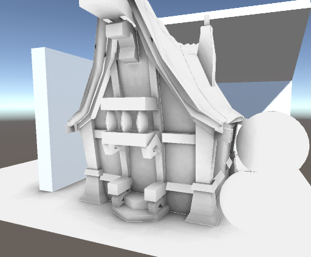
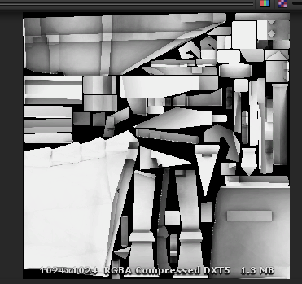

# GPUAOBaker

### 简介：

​	这是一个基于GPU实现光线追踪并生成AOMap的简易AO烘焙工具，主要思路是根据有效半径获取目标对象的Mesh并分批次将其顶点传入shader进行光线追踪计算，并以UV空间渲染到RenderTexture，实现简单的GPUAO烘焙，可以比较快速的完成AO烘焙。

### 已支持功能：

1).实现对指定对象烘焙AO

2).支持包括Hammersley等四种采样器

3).支持Padding

### 待完善功能：

1).暂时不支持自动展开UV，只能基于已有UV烘焙

2).渲染结果抗锯齿功能正在添加

### 参考资料：
本功能中的GPU光线追踪思路参考了@IcsDust发表在知乎Unity Graphics专栏的文章《从零开始的简单光线追踪示例》：
https://zhuanlan.zhihu.com/p/45335463

采样器相关算法与半球映射相关算法参考《光线跟踪算法技术》 [美]萨芬著 刘天慧译(清华大学出版社)

### 我的博客：
http://www.lsngo.net/2018/10/04/unityeditor_gpuaobaker/
